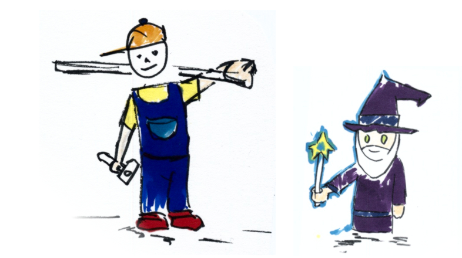

::: {.hero-banner}

::: {.content-block}

::: {.hero-text}
# Welcome to RSEED

The **Research Software Engineering and Economic Data (RSEED) Section at the KOF Swiss Economic Institute, ETH Zurich** is a project-based unit that is currently working on the following two projects:
:::

::: {.hero-image-right}

::: 
:::
:::

::: {.content-block}
# The Hacking for Science Course 

By popular demand, we're bringing the Hacking for Science course back to the D-MTEC PhD program in fall 2024. The course will open to guests from all departments as well as interested guests, and focuses on providing non-computer science students with essential software development skills and big-picture guidance for working with data.

To learn more about the course goals and learner personas find the Hacking4Science Website below. To get the initial schedule of the course, check out the blog post on the h4sci project.

::: {.hero-buttons}

[Hacking4Science Info](h4sci.qmd){.btn-action-primary .btn-action .btn .btn-success .btn-lg role="button"}
[Blog](/blog.qmd){.btn-action-primary .btn-action .btn .btn-lg role="button"}
:::

:::

::: {.content-block}
# The Open Time Series Initiative

Kicked off at useR! 2024 in Salzburg, Austria the project works to make KOF's proven data sourcing pipelines publicly available and reusable. We are working to make data and the processing framework available for researchers. In the future, this GitHub organization will host time series data archives and data processing repositories alike. The first public release is schedule for EoY 2024. 

Access the detailed information about the Open Time Series framework below:

::: {.hero-buttons}
[Open Time Series Framework](/opentsi_draft.qmd){.btn-action-primary .btn-action .btn .btn-success .btn-lg role="button"}
::: 
:::

# What KOF says about RSEED: {style="text-align: center;"}

::: {.content-block}
::: {.features}
::: {.feature}

**Dr. Klaus Abberger:** KOF bridges the gap between data producers and users, enhancing collaboration and data utility.

:::

::: {.feature}

**Dr. Matthias Bannert:** Programming and reproducible research methods increase the impact and inclusivity of our findings.

:::

::: {.feature}

**Prof. Dr. Martin Wörter:** RSEED is crucial for economic policy analysis, enhancing data access and analytical skills.

:::

::: {.feature}

**Oliver Müller:** Integrating Swiss data at KOF boosts its utility for social sciences through robust engineering efforts.

:::

::: {.feature}

**Prof. Dr. Hans Gersbach:** RSEED enhances data quality and access, fostering innovation and improving democratic processes.

:::

::: {.feature}

**Minna Heim:** RSEED aims to make data accessible beyond specialists, fostering community growth and development.

:::